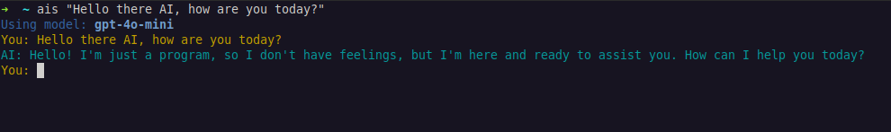

# AI-Shell (ais)



[](https://badge.fury.io/js/ai-shell)
[](https://opensource.org/licenses/ISC)
<!-- [](https://www.npmjs.com/package/ai-shell) -->
<!-- Optional: Add downloads badge after publishing -->

<!-- START doctoc generated TOC please keep comment here to allow auto update -->
<!-- DON'T EDIT THIS SECTION, INSTEAD RE-RUN doctoc TO UPDATE -->
**Table of Contents**  *generated with [DocToc](https://github.com/thlorenz/doctoc)*

- [Installation](#installation)
- [Usage](#usage)
  - [1. Configuration (First Time or Updating)](#1-configuration-first-time-or-updating)
  - [2. Asking a Single Question](#2-asking-a-single-question)
  - [3. End a chat](#3-end-a-chat)
  - [4. Listing Services & Current Configuration](#4-listing-services--current-configuration)
  - [5. Getting Help](#5-getting-help)
- [Configuration Storage](#configuration-storage)
- [Contributing](#contributing)

<!-- END doctoc generated TOC please keep comment here to allow auto update -->


A command-line interface (CLI) tool to interact seamlessly with various AI services like Google (Gemini), OpenAI (GPT) and Anthropic (Claude) directly from your terminal.

For those who feel cursor or co-pilot etc is not for them but loading a whole web-gui is too slow... fire up a terminal in your ide, or wherever, and get right to it.

Engage in interactive chat sessions or get quick answers to single prompts without leaving your command line. `ai-shell` securely stores your preferences and API keys locally.

## Installation

Requires Node.js (v18 or later recommended).

Install the package globally using npm:
```bash
npm install -g ai-shell
```

## Usage
### 1. Configuration (First Time or Updating)

(you can just ask a question and as nothing will be set already it will then ask for which model and keys)

Before using `ais`, you need to configure your preferred AI service, model, and API key. Run:
```bash
ais set
```

This interactive command will guide you through:
- Selecting an AI service provider (OpenAI or Anthropic).
- Choosing a specific model available for that service (e.g., gpt-4o-mini, claude-3-5-sonnet).
- Entering your API key for the selected service (input will be masked).

Your configuration is saved locally for future use. 
- You can run ais set again anytime to change your settings.
- API keys (service keys) are stored in the local config, when jumping between models this speeds up the process by removing the need to copy and paste in the api key more than once.
- When `set` is called and a service picked, but not previously used (ie no api key found), it will ask for an API key and add to the dict of keys

### 2. Asking a Single Question
Pass your prompt directly as arguments after the ais command:
```bash
ais "Explain the difference between HTTP and HTTPS in simple terms"
```

The AI's response will be streamed directly to your terminal leaving you to continue talking to the model.

### 3. End a chat

To end the chat just press "control + c"

### 4. Listing Services & Current Configuration
To see which service and model are currently configured.
This will display the active service provider and model identifier. It will not display your API key.
```bash
ais config
```

To see the available models you can currently talk to:
```bash
ais list
# or the alias:
ais ls
```

### 5. Getting Help & Listing All Commands

For a list of all available commands and options:

```bash
ais --help
```

## Configuration Storage
Configuration (service, model, API key) is stored locally using the conf package. You can typically find the configuration file at:

- Linux: `~/.config/ais-cli-nodejs/config.json`
- macOS: `~/Library/Preferences/ais-cli-nodejs/config.json`
- Windows: `%APPDATA%\ais-cli-nodejs\Config\config.json`

## Contributing
Contributions, issues, and feature requests are welcome! 

